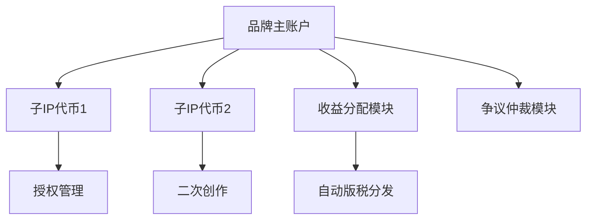

# Story：加密品牌的信任机器

## 加密叙事的缺陷与信任危机

加密市场的发展始终围绕两大核心要素展开：**创新叙事**与**技术落地能力**。以太坊通过"世界计算机"概念重构智能合约生态，Solana以高性能链重塑DeFi格局，这些成功案例揭示了叙事与技术的共生关系。然而，市场也暴露出致命缺陷——**叙事代币化与信任代币化的严重失衡**。

在黄金与比特币的类比中，我们发现：黄金历经万年建立的稀缺性共识，比特币仅用16年便达成相似成就。这种"数字黄金"叙事的快速渗透，印证了加密资产的价值形成机制。但问题同样明显：2024年meme币狂潮暴露了市场对实质创新的漠视，流动性驱动的投机行为正在侵蚀行业根基。

👉 [立即了解加密市场动态](https://bit.ly/okx_welcome)

**核心痛点分析：**
| 问题类型       | 传统解决方案局限性               | 加密市场新挑战                   |
|----------------|----------------------------------|----------------------------------|
| IP保护         | 中心化版权登记效率低下          | 链上资产易分叉导致价值稀释       |
| 信任构建       | 第三方审计成本高昂              | 项目方承诺与执行严重脱节         |
| 利益分配       | 手动结算易引发纠纷              | 智能合约自动执行缺乏灵活性       |
| 品牌价值维护   | 传统法律维权周期长              | 链上争议处理机制缺失             |

## Story的破局之道：IP代币化2.0架构

作为2025年最具突破性的协议层项目，Story通过**三层创新架构**重构加密品牌价值体系：

### 1. 协议层PoC机制：信任的原子化

不同于传统智能合约的信任托管模式，Story构建了**可验证的创造力证明（Proof of Creativity）**。该机制通过：
- **创作过程全链上存证**：从概念设计到成品发布的每个环节数据化
- **动态价值锚定**：将IP生命周期与代币经济模型深度绑定
- **抗分叉保护**：恶意复制需支付5倍于原始质押的Gas费用

### 2. 可编程IP账户体系：品牌治理革命

基于ERC6551++标准的智能账户系统，实现：

### 3. $IP代币经济模型：价值加速引擎

| 模块               | 功能实现                              | 经济激励                              |
|--------------------|---------------------------------------|---------------------------------------|
| 委托质押机制       | 新品牌冷启动资金池                   | 质押者获取IP代币奖励                  |
| 流动性挖矿         | 支持Uniswap V4集中流动性模型         | 交易手续费+协议通胀双重收益           |
| 争议解决基金       | 去中心化仲裁DAO治理                  | Slashing惩罚资金再分配                |
| 品牌发展基金       | 5%通胀率持续投入生态建设             | 优质IP孵化加速器                      |

👉 [探索更多区块链创新](https://bit.ly/okx_welcome)

## FAQ：解码Story核心价值

### Q1：Story如何解决IP链上分叉难题？
通过PoC机制建立**创作起源共识**，任何分叉需从0开始积累证明数据。配合Slashing机制，恶意分叉者需支付原始质押金额3-5倍的代价。

### Q2：$IP代币与普通治理代币有何区别？
$IP兼具**品牌债券属性**，其价值与特定IP的商业表现直接挂钩。质押者不仅参与治理，更直接分享品牌成长红利。

### Q3：中小开发者如何参与Story生态？
Story提供**IP碎片化发行**方案，允许将创意拆分为NFT形式的基础单元。开发者可通过贡献设计、代码等要素获取对应权益。

### Q4：如何保障链下IP上链的真实性？
采用**预言机+零知识证明**的混合验证体系，将传统版权登记信息与链上数据进行加密关联验证。

## 未来展望：61万亿美元IP市场的链上革命

Story正在构建的**加密品牌信任基础设施**，或将重塑以下市场格局：

| 传统IP产业痛点       | Story解决方案                  | 市场规模预测(2025) |
|----------------------|--------------------------------|---------------------|
| 授权流程繁琐         | 智能合约自动执行               | 年节省成本$42亿     |
| 二次创作版权纠纷     | 可追溯的授权链                 | 减少纠纷量73%       |
| 价值评估主观         | 链上数据驱动的估值模型         | 流动性提升4.8倍     |
| 跨境维权困难         | 去中心化仲裁网络               | 争议处理时效<72小时 |

随着AI生成内容（AIGC）与加密资产的深度融合，Story的IP代币化方案为数字时代的价值创造提供了全新范式。通过将品牌建设过程转化为**可量化、可交易、可编程**的链上资产，该项目正在为加密市场注入真正的长期价值。

👉 [把握加密经济转型机遇](https://bit.ly/okx_welcome)