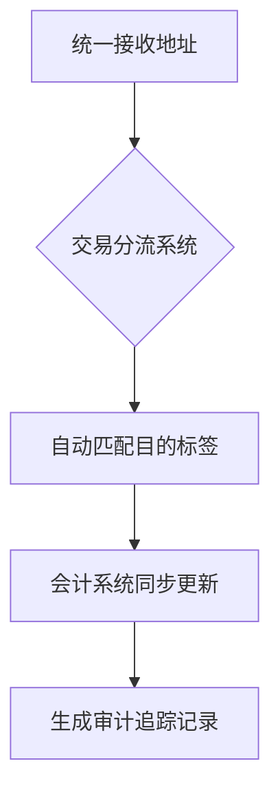

# 向Ledger Nano S发送XRP：目的标签详解

## 什么是XRP目的标签？

在向Ledger Nano S钱包发送XRP时，**目的标签（Destination Tag）** 是确保资金准确到账的关键要素。这个由数字或字母组成的唯一标识符，如同快递包裹的收件人信息，能帮助系统识别资金的最终归属。当多个用户共用同一钱包地址时（如交易所场景），目的标签就成为区分不同账户的"身份ID"。

👉 [了解OKX钱包如何管理多链资产](https://bit.ly/okx_welcome)

### 核心作用解析
- **地址共享场景**：类似公寓楼共用门牌号，但每户有独立信箱
- **交易追溯**：为每笔转账添加"备注编号"，方便后续追踪
- **风险防控**：避免因地址混淆导致的资金错配

## 为何向Ledger Nano S发送XRP必须使用目的标签？

### 技术架构特性
Ledger Nano S采用**单一地址多账户管理**机制，如同企业共用公司账户但内部有不同部门子账。目的标签在此扮演"部门编号"角色，确保资金准确分配到对应账户。

### 典型应用场景
| 使用场景          | 核心作用                      | 潜在风险                  |
|-------------------|-----------------------------|-------------------------|
| 交易所充值        | 区分不同用户账户              | 未填标签导致充值失败      |
| 企业资金管理      | 划分部门/项目资金             | 资金归属争议              |
| 多钱包账户管理    | 对应不同子钱包                | 资金错配需人工申诉        |

## 如何获取Ledger Nano S的XRP目的标签？

### 操作指南（最新版Ledger Live界面）
1. **连接设备**：通过USB连接硬件钱包并解锁
2. **启动XRP应用**：在设备上确认打开XRP钱包
3. **获取地址信息**：
   - 打开Ledger Live → 选择XRP账户
   - 点击"接收" → 查看完整地址信息
4. **定位目的标签**：
   - 地址栏下方显示"Memo"字段
   - 含数字组合（如：123456789）

👉 [探索OKX钱包的多链管理功能](https://bit.ly/okx_welcome)

### 注意事项
- 每个新建账户会生成新地址+新目的标签
- 建议同时保存地址和标签的二维码
- 切勿复用其他账户的目的标签

## 发送XRP时如何正确填写目的标签？

### 标准操作流程
1. **选择发送平台**：交易所/钱包应用确认支持XRP标签填写
2. **输入接收信息**：
   - 收款地址：`rHb9CJAWyB9X1w9kD2W11E7U31zZ7aDssu`
   - 目的标签字段：输入`123456789`
3. **双重验证机制**：
   - 系统自动校验字段格式
   - 手动核对地址与标签的匹配性

### 常见错误对照表
| 错误类型       | 典型表现                  | 解决方案                |
|----------------|-------------------------|-----------------------|
| 标签位数错误   | 系统提示"Invalid Memo"    | 检查数字位数（通常9位） |
| 地址标签不符   | 交易状态卡顿              | 重新获取最新地址信息    |
| 标签格式错误   | 提交时自动报错            | 仅输入数字字符          |

## 忘记填写目的标签的后果及补救

### 风险矩阵分析
| 风险等级 | 可能结果                      | 处理难度 |
|----------|-----------------------------|----------|
| ⚠️ 高风险  | 资金进入公共地址池            | 需人工介入 |
| ⚠️ 中风险  | 交易确认延迟（24-72小时）     | 联系客服 |
| ⚠️ 低风险  | 系统自动退回（部分平台支持）  | 等待处理 |

### 补救措施指南
1. **立即操作**：
   - 保存交易哈希（TXID）
   - 截图发送界面证明
2. **平台沟通**：
   - 提供完整地址+时间戳
   - 提交身份验证文件
3. **技术追溯**：
   - 使用[Bithomp](https://bithomp.com/)区块链浏览器查询
   - 确认交易状态（Success/Pending）

👉 [体验OKX钱包的智能标签管理功能](https://bit.ly/okx_welcome)

## 常见问题解答（FAQ）

### Q1：所有XRP转账都需要目的标签吗？
**A**：当接收方使用共享地址系统时必须填写，个人钱包间转账可选。建议始终填写以确保安全。

### Q2：目的标签填错怎么办？
**A**：立即联系平台客服，提供：
- 完整交易截图
- 错误标签号码
- 正确账户信息
部分平台支持人工归集服务。

### Q3：如何验证交易是否成功？
**A**：三步验证法：
1. Ledger Live余额变动
2. 区块链浏览器确认（需等待3-6个确认）
3. 平台账户到账通知

## 目的标签管理最佳实践

### 安全存储方案
- **物理备份**：使用加密笔记本记录地址+标签组合
- **数字存储**：硬件钱包安全区保存PDF文件
- **版本控制**：定期更新标签记录（建议每月检查）

### 企业级管理策略

## XRP转账技术参数对照表

| 参数项          | 要求标准                  | Ledger Nano S实现       |
|-----------------|--------------------------|------------------------|
| 最小交易额      | 0.00001 XRP              | 自动计算               |
| 网络确认时间    | 3-5秒                    | 实时同步               |
| 标签格式        | 20位以内数字              | 9位标准                |
| 交易手续费      | 0.00001 XRP               | 动态浮动（<0.001美元） |
