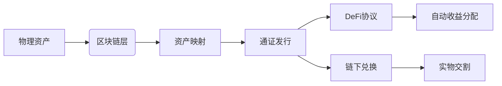

# 实体资产通证化：区块链技术重构金融生态的三大核心价值

## 什么是实体资产通证化

实体资产通证化（Real-World Assets Tokenization）通过区块链技术将物理世界中的金融资产转化为数字通证。这种创新模式正在重塑资产流通方式，其核心价值体现在以下方面：

- **流动性跃升**：传统资产如房地产、艺术品等因交易流程复杂导致流动性受限，通证化后可实现7×24小时全球交易
- **收益优化**：智能合约自动执行分红、利息结算等操作，降低中介成本约40-60%
- **资产民主化**：100美元即可投资价值百万的商业地产，门槛降低90%以上

> "通证化不是替代传统金融，而是为其注入区块链基因。" - 摩根大通区块链部门主管

## 技术实现全解析

### 通证化实施四阶段

| 阶段       | 核心操作                     | 关键技术支撑               |
|------------|------------------------------|--------------------------|
| 资产筛选   | 评估合规性、流动性、价值稳定性 | 数字身份验证、资产溯源系统 |
| 法律架构   | 设计合规框架、智能合约条款     | 零知识证明、隐私计算      |
| 通证铸造   | 链上生成对应数字凭证           | 跨链桥接、预言机数据接口  |
| 交易流通   | 二级市场撮合、收益分配         | 自动做市商(AMM)、DVP结算机制 |

👉 [掌握最新通证化项目动态](https://bit.ly/okx_welcome)

### 典型应用场景对比

传统房产交易 vs 通证化房产交易：

```markdown
1. 传统模式痛点
   - 交易周期：平均45天
   - 中介费用：交易额的2-3%
   - 投资门槛：整套房产购买

2. 通证化优势
   - 实时结算：平均15分钟完成
   - 手续费：0.5%以下
   - 碎片化投资：最低100美元起投
```

## 核心技术架构解析

### 双链架构设计



这种架构确保资产在链上链下的双向流动性，通过预言机网络实时同步物理资产状态。新加坡星展银行已采用该架构实现大宗商品通证化，交易效率提升70%。

👉 [体验区块链资产交易新体验](https://bit.ly/okx_welcome)

## 监管与合规前沿

全球主要司法管辖区对RWA的监管框架呈现差异化特征：

| 地区       | 监管态度     | 典型案例                   |
|------------|--------------|----------------------------|
| 瑞士       | 沙盒监管     | 220亿美元政府债券通证化    |
| 新加坡     | 持牌经营     | 金管局MAS推出Project Guardian |
| 阿联酋     | 税收优惠     | 阿布扎比全球通证化平台     |
| 中国香港   | 有限试点     | 证监会监管沙盒项目         |

合规要点包括：
- KYC/AML双层验证机制
- 地理区域访问控制
- 交易额度动态调整
- 链上身份绑定

## 投资机遇与挑战

### 2024年市场趋势预测

```markdown
1. 增长领域
   - 碳信用通证化：预计年复合增长率85%
   - 私募股权流通：2024年规模突破500亿美元
   - 基础设施REITs：亚洲市场占比达40%

2. 潜在风险
   - 监管套利空间收窄
   - 跨链清算延迟风险
   - 法律效力认定差异
```

👉 [把握数字资产投资新风口](https://bit.ly/okx_welcome)

## 常见问题解答

**Q：个人投资者如何参与RWA投资？**  
A：通过合规交易平台进行KYC认证后，可购买各类通证化资产，最低投资门槛通常低于1000美元。

**Q：通证化资产是否受传统金融监管？**  
A：双轨制监管是主流，既需符合传统金融法规，又要满足区块链合规要求，如美国SEC Reg A+框架。

**Q：如何保证链下资产与通证的对应关系？**  
A：采用物联网传感器+人工审计双重验证，瑞士Sygnum银行已实现黄金储备每日链上公示。

**Q：遭遇技术故障如何保障权益？**  
A：智能合约内置应急熔断机制，新加坡IMDA机构要求强制投保数字资产保险。

**Q：未来哪些资产最具通证化潜力？**  
A：碳信用额度、供应链金融票据、知识产权收益权等标准化程度高的资产将率先突破。