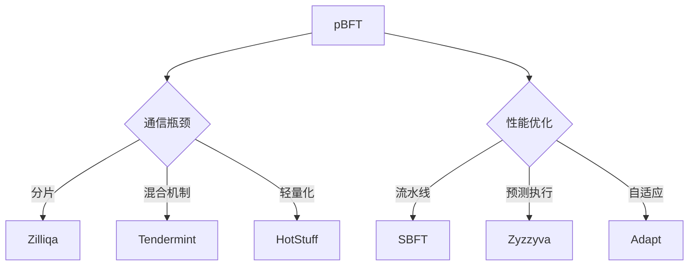

# 实用拜占庭容错（pBFT）技术解析

## 核心概念与背景

### 拜占庭将军问题溯源
实用拜占庭容错（pBFT）技术源于经典的分布式系统难题——拜占庭将军问题。该问题由Leslie Lamport等人在1982年的论文中提出，形象化描述了分布式节点在存在故障或恶意节点时达成共识的挑战。

在这一经典场景中：
- 拜占庭军队的多个军团需协同进攻
- 忠诚将领需达成统一作战计划
- 潜在的叛徒可能传递错误信息
- 系统需确保：
  1. 所有忠诚将领执行相同计划
  2. 少数叛徒无法破坏作战决策

**共识达成条件**：
若系统包含3m+1个正常节点，当故障节点不超过m个时即可达成共识。这意味着系统至少需要2/3以上诚实节点，这一数学基础构成了现代分布式共识算法的基石。

👉 [深入了解区块链共识机制](https://bit.ly/okx_welcome)

## 技术原理与运行机制

### pBFT的核心工作流程
pBFT通过四阶段共识协议实现高效容错，其典型执行流程如下：

| 阶段 | 操作描述 | 关键特征 |
|------|----------|----------|
| 1. 请求 | 客户端向主节点发送请求 | 包含时间戳防止重放 |
| 2. 预准备 | 主节点广播请求至备份节点 | 生成唯一序列号 |
| 3. 准备 | 节点验证并交换签名信息 | 需收集2m+1个签名 |
| 4. 提交 | 节点广播提交确认 | 需要m+1个相同响应 |

**容错机制**：
- 当主节点失效时，通过视图变更协议（view change protocol）选举新主节点
- 节点需验证所有响应的一致性
- 采用门限签名技术提高验证效率

### 关键技术指标
```text
通信复杂度：O(n²) 
容错阈值：最多允许 (n-1)/3 个恶意节点
最终性确认：1个共识轮次
能耗比：PoW的1/1000
```

## 技术优势与创新价值

### 三大核心优势
1. **即时最终性**：
   - 交易确认无需多轮确认（如比特币需6个区块确认）
   - 确认延迟可控制在秒级（平均2-5秒）

2. **能源效率**：
   - 相比PoW节省99.9%能耗
   - 适用于绿色计算场景

3. **公平激励**：
   - 所有参与节点均可获得奖励
   - 奖励差异度低于5%（PoW可能达30%+）

👉 [探索高效共识算法的应用场景](https://bit.ly/okx_welcome)

## 应用挑战与解决方案

### 主要技术瓶颈
1. **可扩展性限制**：
   - 节点数量与通信量呈平方级增长
   - 100节点系统需维护4950条通信链路

2. **Sybil攻击风险**：
   - 需要身份验证机制配合
   - 常与PoW/PoS混合使用

3. **网络延迟敏感**：
   - 跨地域部署时性能下降明显
   - 需优化消息传输协议

### 典型优化方案
| 优化方向 | 技术方案 | 效果提升 |
|---------|----------|----------|
| 分片机制 | Zilliqa的PoW+pBFT混合 | 节点扩展至数千 |
| 视图切换 | Tendermint快速同步 | 宕机恢复<1秒 |
| 轻节点设计 | Hyperledger Fabric MSP | 验证效率提升70% |

## 行业应用与演进趋势

### 主流应用平台
1. **Zilliqa**：
   - 每100个区块采用PoW+pBFT混合机制
   - 实现10,000+ TPS吞吐量

2. **Hyperledger Fabric**：
   - 企业级许可链解决方案
   - 支持模块化共识组件

3. **Tendermint**：
   - Cosmos网络核心共识引擎
   - 支持跨链通信验证

### 技术演进路径


## FAQ常见问题

### Q1: pBFT相比PoW有哪些本质区别？
A: pBFT采用确定性共识机制，通过节点间消息验证达成一致，无需消耗算力资源。其交易确认速度更快（秒级），但节点扩展性较差（建议<100节点），更适合联盟链场景。

### Q2: 如何应对pBFT的通信开销问题？
A: 主要通过三种方式优化：
1. 分片技术（如Zilliqa的PoW+pBFT混合）
2. 分层架构（如Tendermint的轻节点设计）
3. 异步验证（如SBFT的流水线优化）

### Q3: pBFT在区块链领域有哪些典型应用？
A: 主要应用于：
- 金融级联盟链（如Hyperledger Fabric）
- 高性能公链（如Zilliqa）
- 跨链协议（如Cosmos IBC）
- 物联网设备共识（如IoTeX）

### Q4: pBFT的容错阈值如何计算？
A: 系统最大容忍故障节点数为m=⌊(n-1)/3⌋。例如：
- 4节点系统可容忍1个故障节点
- 7节点系统可容忍2个故障节点
- 10节点系统可容忍3个故障节点

### Q5: pBFT的未来发展方向？
A: 当前主要演进方向包括：
- 与零知识证明结合实现隐私保护
- 与AI结合优化节点选择算法
- 在5G边缘计算场景的轻量化部署
- 支持动态节点增减的弹性架构

👉 [查看最新共识算法研究报告](https://bit.ly/okx_welcome)