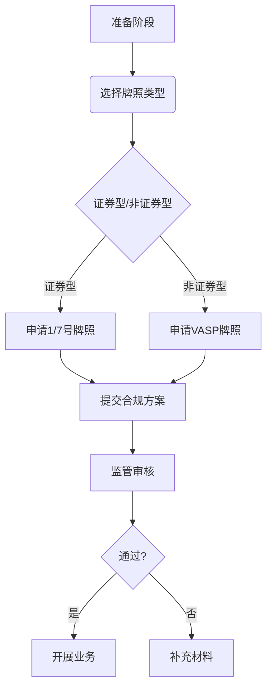

# 香港加密货币政策全解析：虚拟资产监管新纪元

## 一、解码加密货币生态体系

### 1.1 加密货币的本质特征
根据香港金融管理局2022年发布的《加密资产和稳定币讨论文件》，加密货币作为基于密码学和分布式账本技术的数字资产，已形成独特的金融生态系统。其核心特征体现在：
- 去中心化架构
- 不可篡改性
- 点对点交易机制
- 智能合约自动执行

👉 [深入理解区块链技术原理](https://bit.ly/okx_welcome)

### 1.2 业态演进全景图
加密货币衍生出的九大核心业态构成完整产业闭环：

| 发展阶段 | 典型产品                | 市场规模占比 |
|----------|-------------------------|--------------|
| 基础层   | 公链/联盟链/私有链      | 28%          |
| 交易层   | 加密货币交易所/DeFi     | 35%          |
| 应用层   | NFT/元宇宙/数字凭证     | 22%          |
| 投资层   | ETF基金/证券化代币      | 15%          |

当前全球加密市场总值稳定在万亿美元规模，香港作为亚洲枢纽的加密货币就绪度（CRS）达8.36，位居全球首位。

## 二、监管框架演进时间轴

### 2.1 里程碑事件回顾
- **2016-2018**：区块链沙盒测试阶段
- **2018.11**：证监会确立证券型代币监管框架
- **2019**：实施1/7号牌照制度
- **2022.6**：反洗钱条例纳入VASP牌照
- **2023.6**：虚拟资产交易平台指引生效

👉 [查看最新虚拟资产牌照申请流程](https://bit.ly/okx_welcome)

### 2.2 多维度监管矩阵
| 监管维度       | 证券型代币               | 非证券型代币             |
|----------------|--------------------------|--------------------------|
| 发行主体       | 需1/7号牌照              | 需VASP牌照               |
| 交易场所       | 受证监会监管              | 受金管局监管             |
| 披露要求       | 证券招股说明书标准        | 虚拟资产披露指引         |
| 投资者保护     | 适用《公司法》相关条款    | 适用《反洗钱条例》       |

## 三、市场准入关键考量

### 3.1 业务类型合规要点
**代币铸造维度：**
- 证券型代币需遵循《证券及期货条例》
- NFT监管采用"功能实质判断"原则
- 功能型代币适用《税务条例释义第39号》

**税收合规框架：**
```markdown
1. 首次发行：
   - 证券型代币：免税
   - 功能型代币：预付款征税
   - 支付型代币：销售收入征税

2. 交易环节：
   - 企业：仅就境内收益纳税
   - 个人：按市场价值计征
```

### 3.2 牌照申请流程


## 四、常见问题解答（FAQ）

**Q1：个人投资者如何参与加密货币交易？**
A：2023年6月新规后，持牌平台已向零售投资者开放比特币、以太坊等主流币种交易，单日交易限额为100万港元。

**Q2：NFT艺术品交易是否需要牌照？**
A：若NFT具有证券属性（如分红权），需申请相关牌照；普通数字藏品交易目前暂不受牌照限制。

**Q3：稳定币发行有哪些特殊要求？**
A：金管局拟实施"储备100%审计+每日流动性监测"制度，要求发行机构持牌运营并定期披露资产储备情况。

👉 [了解稳定币发行合规方案](https://bit.ly/okx_welcome)

## 五、未来发展趋势

### 5.1 政策红利释放
- 绿色债券代币化试点
- Web3.0创新实验室设立
- 粤港澳大湾区数字资产互通

### 5.2 技术演进方向
| 技术领域       | 应用场景                 | 预计落地时间 |
|----------------|--------------------------|--------------|
| 隐私计算       | 合规化DeFi交易           | 2024Q2       |
| 跨链协议       | 多链资产互通             | 2023Q4       |
| 零知识证明     | 合规匿名交易             | 2025Q1       |

当前香港区块链金融初创企业已达264家，涵盖交易平台、资管、媒体等12个细分领域。随着《债券市场代币化》政策的推进，预计到2024年底，港元稳定币市场规模将突破500亿港元。
